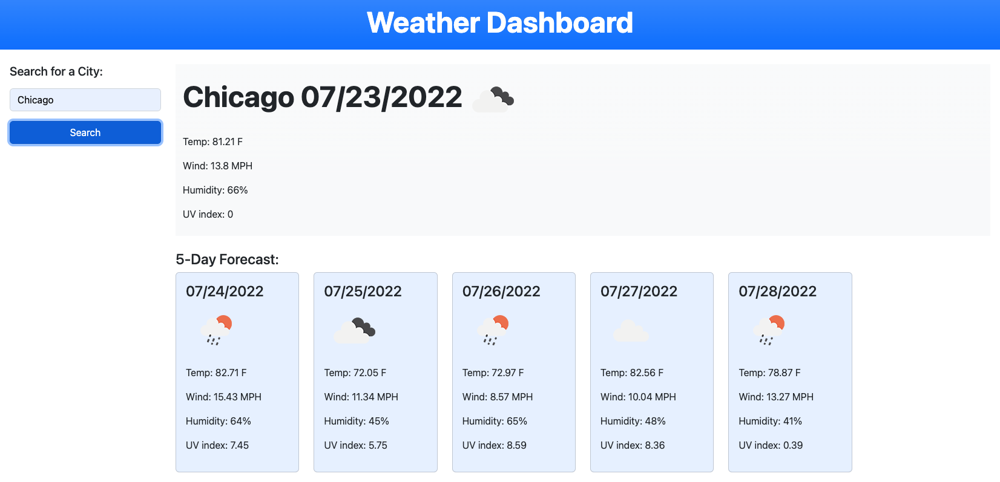

# Weather_Dashboard

## Description

A weather dashboard that retrieves weather data by city. It shows the current weather as well as a 5-day forecast.

## Usage

The following image shows the application's appearance and functionality:

## Credits

https://getbootstrap.com/

https://openweathermap.org/api/one-call-api

https://cdnjs.com/libraries/moment.js

https://coding-boot-camp.github.io/full-stack/apis/how-to-use-api-keys

https://www.w3schools.com/bootstrap5/index.php

## URL

GitHub: https://github.com/an-n-ie/06_Weather_Dashboard

Website: https://an-n-ie.github.io/06_Weather_Dashboard/
